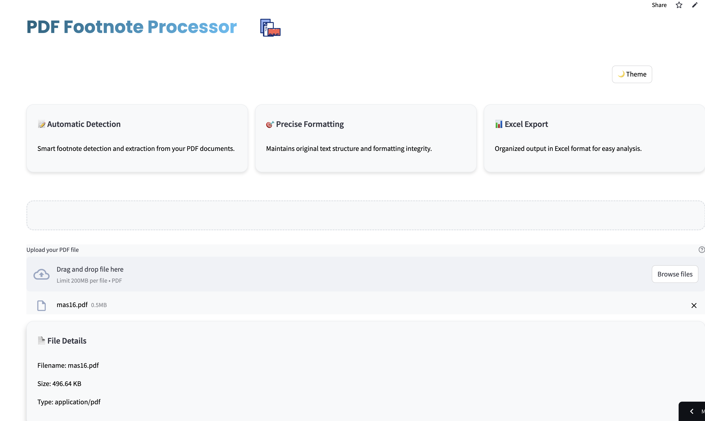
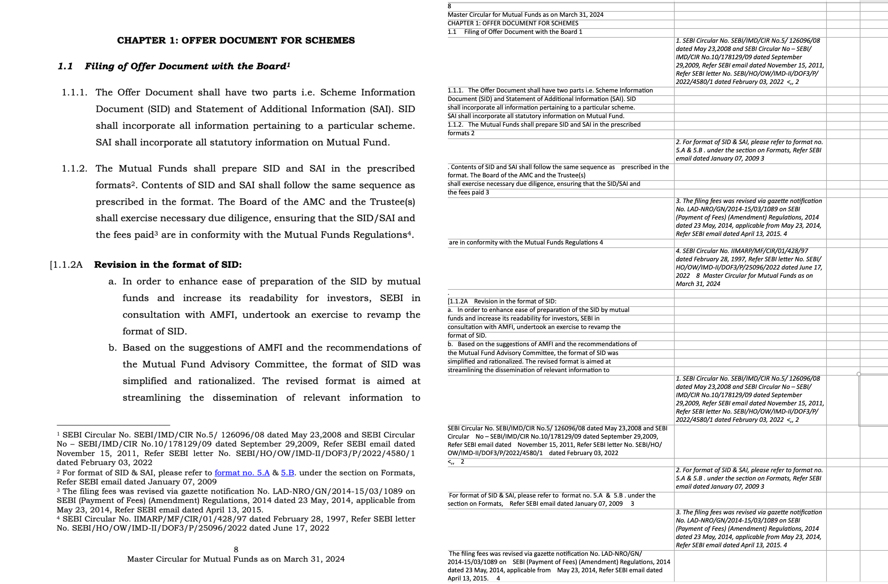

**PDF Footnotes Processor | Full Stack Development**
*Personal Project | GitHub*

Developed a web application that processes PDF documents to extract and organize footnotes into structured Excel files.

**Technical Stack:**
- **Backend:** Python, Streamlit, PyMuPDF, Pandas
- **Frontend:** HTML5, CSS3, TailwindCSS, JavaScript
- **Data Processing:** OpenPyXL, RegEx, File I/O
- **DevOps:** Git, GitHub Actions, GitHub Pages

**Key Achievements:**
- Implemented automated footnote detection and extraction system
- Created responsive UI with dark/light mode functionality
- Deployed application using GitHub Actions and Pages
- Integrated error handling and logging system
